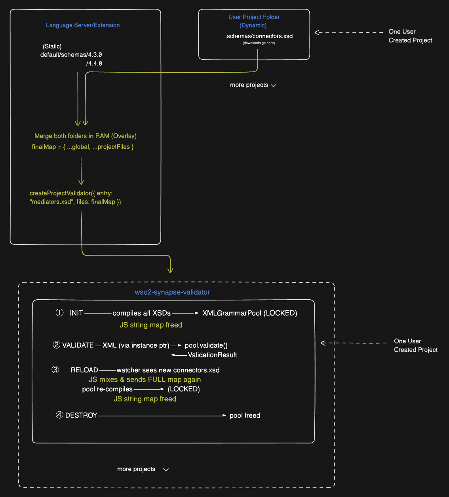

# wso2-synapse-validator

> XML/XSD validation engine for the WSO2 MI Language Server — Apache Xerces-C compiled to WebAssembly.

Schema is compiled once per project into a persistent WASM grammar pool. Every `validate()` call reuses it — no re-parsing on keystrokes.

---

## How it works



---

## Multiple projects

Each project gets its own grammar pool in WASM memory. They share one WASM instance but never share state.

```
WASM instance (one, shared)
│
├── ProjectValidator [workspace A]  — MI 4.3.0, no connectors
│     pool: [4.3.0 grammar]
│
├── ProjectValidator [workspace B]  — MI 4.3.0, s3 connector
│     pool: [4.3.0 + s3 grammar]
│
├── ProjectValidator [workspace C]  — MI 4.4.0, no connectors
│     pool: [4.4.0 grammar]
│
└── ProjectValidator [workspace D]  — MI 4.4.0, s3 + http connectors
      pool: [4.4.0 + s3 + http grammar]
```

---

## Setup

Requires Git, Node.js, and an internet connection for the first build. Everything else (Emscripten, Xerces-C) is fetched automatically.

```bash
git clone --recurse-submodules https://github.com/harshanacz/wso2-synapse-validator
npm install
npm run build:wasm   # installs Emscripten automatically on first run
npm test
```

> **Note:** `npm run build:wasm` downloads the Emscripten toolchain (~500 MB) into `tools/emsdk/` on the first run. Subsequent builds skip this step.

---

## Build

```bash
npm run build:wasm   # compile Xerces-C → wasm/xerces_validator.{js,wasm}
npm run build:ts     # compile TypeScript → dist/
npm test
```

---

## License

MIT — see [LICENSE](./LICENSE).  
Includes Apache Xerces-C — see [native/xerces-c/LICENSE](native/xerces-c/LICENSE).
