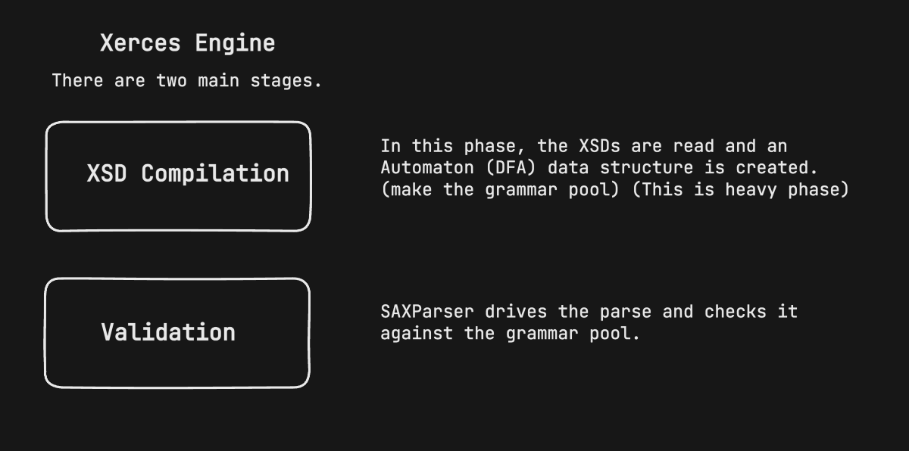
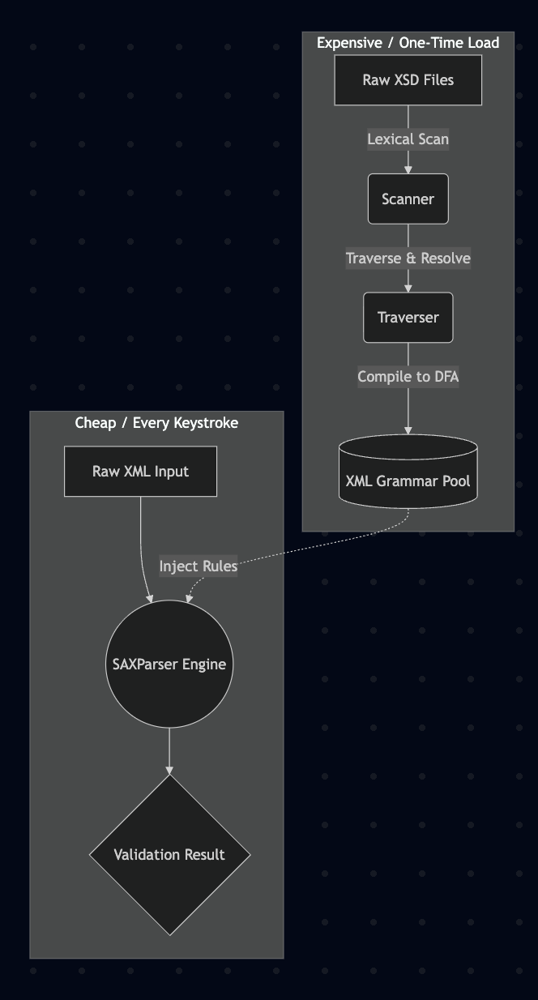
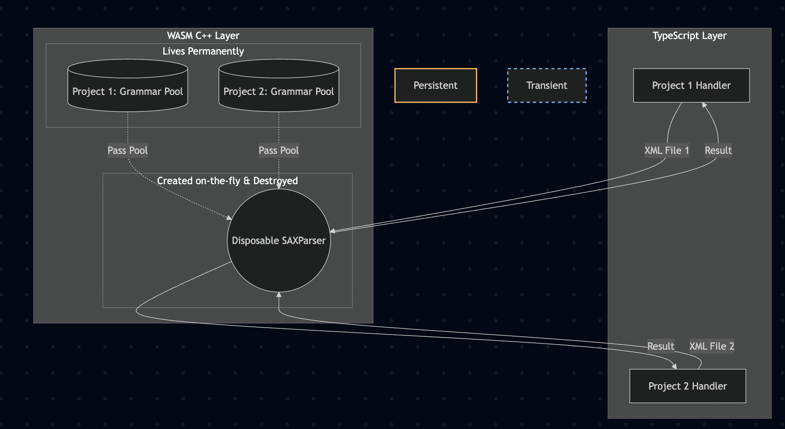

# WASM XML Validator

> XML validator using Apache Xerces-C++ compiled to WebAssembly. Features in-memory XSD caching for validation.

## How it works

Xerces-C++ validation inherently splits into two main phases. The initial XSD parsing and compilation takes time, while the validation is fast.



### The Validation Lifecycle

This shows how Xerces processes schemas versus how it validates XML files.



1. **One-Time Setup**: Raw XSD files are scanned, traversed, and compiled into DFA (Deterministic Finite Automata) structures. This is stored as the **XML Grammar Pool**.
2. **Validation**: The raw XML input is streamed through the pre-compiled Grammar Pool rules using a transient `SAXParser` engine.

## Our Architecture

We use WebAssembly linear memory to avoid re-parsing XSDs on every validation.



We separate the state:
- **Persistent State**: We compile the schema **once** and lock it inside an `XMLGrammarPool` in the WASM heap. Each workspace project maintains its own isolated pool.
- **Transient Engine**: On every `validate()` call, we create a new, disposable `SAXParser` engine. It attaches to the existing project grammar pool, validates the XML, and is destroyed.

---

## Quick example

```ts
import { createProjectValidator } from "wso2-synapse-validator";

// 1. Create a validator. This parses XSDs and caches the Grammar Pool in WASM memory.
const v = await createProjectValidator({
  entry: "main.xsd",
  files, // Map of { filename: xsdText }
});

// 2. Validate. It creates a transient SAXParser and uses the cached pool.
const result = await v.validate(`<log level="full"/>`);
console.log(result.valid); // true / false

// 3. Destroy to free the C++ allocations from WASM memory.
v.destroy();
```

---

## Setup & Build

Requires Git, Node.js, and an internet connection. Emscripten and Xerces-C are fetched automatically.

```bash
# Clone the repository
git clone --recurse-submodules https://github.com/harshanacz/wso2-synapse-validator

# Install Node dependencies
npm install

# Compile Xerces-C → wasm/xerces_validator.{js,wasm}
# (Downloads the Emscripten toolchain on first run)
npm run build:wasm   

# Compile TypeScript → dist/
npm run build:ts     

# Run the test suite
npm test
```

---

## License

MIT — see [LICENSE](./LICENSE).  
Includes Apache Xerces-C — see [native/xerces-c/LICENSE](native/xerces-c/LICENSE).
