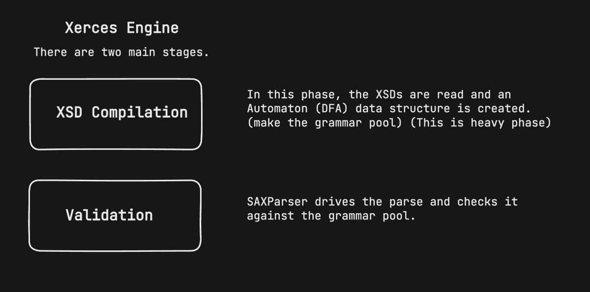
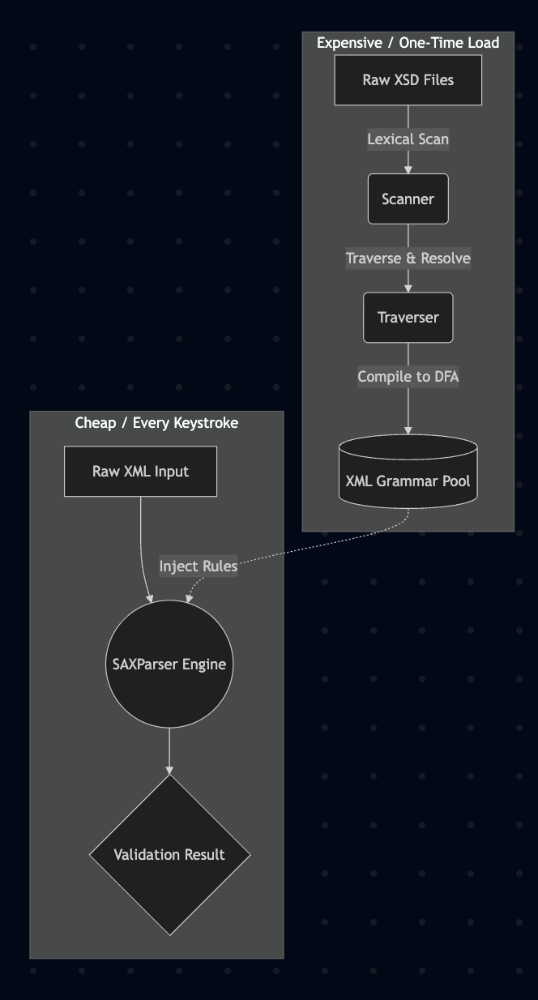
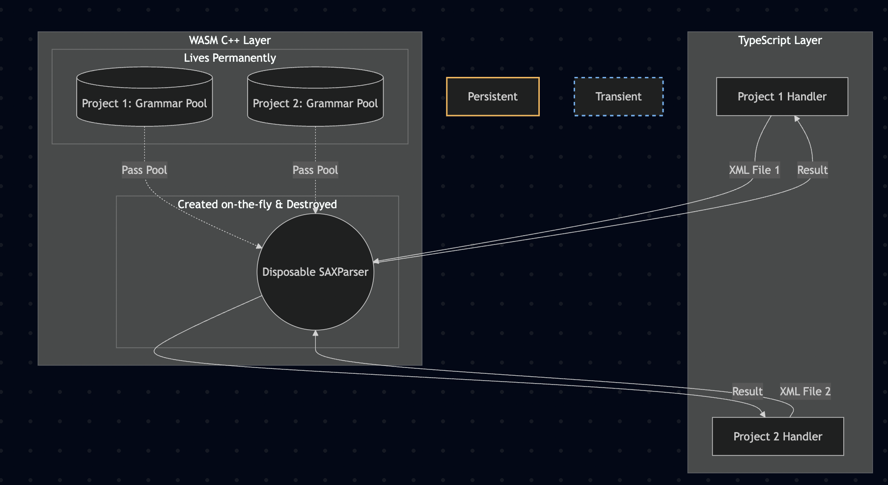

# WASM XML Validator
> XML validator using Apache Xerces-C++ compiled to WebAssembly. Features in-memory XSD caching for validation.

[](https://www.npmjs.com/package/xerces-wasm)

Install

```bash
npm install xerces-wasm
```


## Playground

Try the interactive [Browser playground for xerces-wasm](https://harshanacz.github.io/xerces-playground/) to run XML validation directly in your browser. The source code is available on [GitHub](https://github.com/harshanacz/xerces-playground).

## Performance & Benchmarks

`xerces-wasm` uses Apache Xerces C++ compiled to WebAssembly with an in-memory **Grammar Pool Caching** architecture (`createProjectValidator`). 

Unlike stateless WASM wrappers that re-parse schemas on every call, `xerces-wasm` pre-parses XSD schemas once into WebAssembly memory, enabling ultra-low latency validation for high-throughput Node.js backends and browser applications.

A comprehensive, publication-grade benchmark comparing **`xerces-wasm`** against **`xmllint-wasm`** (executed on Apple M4, Node.js v22 with $n=5$ interleaved trials) yielded the following results:

---

### Benchmark Summary

| Metric / Scenario | `xmllint-wasm` | `xerces-wasm` | Advantage / Impact |
| :--- | :--- | :--- | :--- |
| **Single Schema Warm Loop (1,000 runs)** | 22,908 ms | **41.7 ms** | **⚡ 549x Faster** |
| **Multi-File Modular Schemas (4 XSDs)** | 23,916 ms | **69.1 ms** | **⚡ 346x Faster** |
| **Small Payload Latency (1.2 KB)** | 23.19 ms / val | **0.06 ms / val** | **⚡ 362x Faster** |
| **Medium Payload Throughput (100 KB)** | 3.59 MB/s | **34.70 MB/s** | **⚡ 9.6x Throughput** |
| **Error-Path Performance (Schema-Invalid XML)** | 24.59 ms / call | **0.07 ms / call** | **⚡ 355x Faster** |
| **Memory Allocation Delta (1,000 runs)** | +2.25 MB | **+0.41 MB** | **🧠 ~14x Lower Memory** |
| **50 Parallel Validations (`Promise.all`)** | 221.58 ms | **3.57 ms** | **⚡ 62x Faster** |

*Full reproducible benchmark code and methodology available at [xml-val-benchmark](https://github.com/harshanacz/xml-val-benchmark).*

---

### Architectural Insights & When to Use `xerces-wasm`

- **High-Throughput Microservices & APIs:** When validating many XML documents against pre-loaded XSD schemas, `xerces-wasm` reuses the compiled WASM Grammar Pool, delivering validation latencies of **~0.06 ms per call**.
- **Multi-File XSD Projects:** Supports complex modular schemas (`xs:include` / `xs:import`) natively in WASM memory without virtual filesystem preloading taxes.
- **Payload Scaling Consideration:** For standard payloads (<1MB), `xerces-wasm` dominates due to zero schema-reparsing overhead. For massive XML documents (>5MB), validation is compute-bound, where streaming engines scale throughput up to ~50 MB/s.
- **Main-Thread Execution:** `xerces-wasm` executes synchronously on the main thread for zero-copy memory access. For heavy batch processing of multi-megabyte payloads in server environments, offloading validation to worker threads or a background queue is recommended.


## Playground

Try the interactive [Browser playground for xerces-wasm](https://harshanacz.github.io/xerces-playground/) to run XML validation directly in your browser. The source code is available on [GitHub](https://github.com/harshanacz/xerces-playground).

## How it works

Xerces-C++ validation inherently splits into two main phases. The initial XSD parsing and compilation takes time, while the validation is fast.



### The Validation Lifecycle

This shows how Xerces processes schemas versus how it validates XML files.



1. **One-Time Setup**: Raw XSD files are scanned, traversed, and compiled into DFA (Deterministic Finite Automata) structures. This is stored as the **XML Grammar Pool**.
2. **Validation**: The raw XML input is streamed through the pre-compiled Grammar Pool rules using a transient `SAXParser` engine.

## Our Architecture

We use WebAssembly linear memory to avoid re-parsing XSDs on every validation.



We separate the state:
- **Persistent State**: We compile the schema **once** and lock it inside an `XMLGrammarPool` in the WASM heap. Each workspace project maintains its own isolated pool.
- **Transient Engine**: On every `validate()` call, we create a new, disposable `SAXParser` engine. It attaches to the existing project grammar pool, validates the XML, and is destroyed.

---

## Quick example

```ts
import { createProjectValidator } from "xerces-wasm";

// 1. Create a validator. This parses XSDs and caches the Grammar Pool in WASM memory.
const v = await createProjectValidator({
  entry: "main.xsd",
  files, // Map of { filename: xsdText }
});

// 2. Validate. It creates a transient SAXParser and uses the cached pool.
const result = await v.validate(`<log level="full"/>`);
console.log(result.valid); // true / false

// 3. Destroy to free the C++ allocations from WASM memory.
v.destroy();
```

---

## Setup & Build

Requires Git, Node.js, and an internet connection. Emscripten and Xerces-C are fetched automatically.

```bash
# Clone the repository
git clone --recurse-submodules https://github.com/harshanacz/xerces-wasm-validator

# Install Node dependencies
npm install

# Compile Xerces-C → wasm/xerces_validator.{js,wasm}
# (Downloads the Emscripten toolchain on first run)
npm run build:wasm   

# Compile TypeScript → dist/
npm run build:ts     

# Run the test suite
npm test
```

---
## Reproducible builds

See [docs/reproducible-wasm-build.md](docs/reproducible-wasm-build.md).

## License

MIT — see [LICENSE](./LICENSE).  
Includes Apache Xerces-C++ (Apache-2.0) — see [LICENSE-APACHE](./LICENSE-APACHE) and [NOTICE](./NOTICE).
